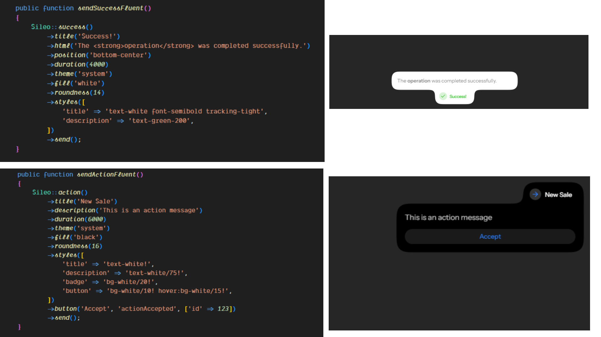

# wire-sileo

A Laravel Livewire package that brings beautiful toast notifications to your Livewire applications. Inspired by the elegant UI of [Sileo](https://github.com/hiaaryan/sileo) and built with the Livewire notification patterns pioneered by [Livewire Alert](https://github.com/jantinnerezo/livewire-alert).

## Features

- **Fluent PHP API** - Chain methods to build beautiful toasts
- **Multiple toast types** - Success, error, warning, info, loading, and action toasts
- **Promise support** - Show loading states that resolve/reject based on backend logic
- **Full customization** - Position, duration, theme, styles, and more
- **Livewire-native** - Works seamlessly with Livewire 3+ component lifecycle

## Installation

Install the package and frontend dependencies:

```bash
composer require mrclln/wire-sileo
npm install sileo lucide-react react react-dom
```

The package requires:
- `sileo` - The React toast component (v0.1.5+)
- `lucide-react` - Icon library for custom icons
- `react` and `react-dom` - Required by Sileo

Publish the configuration, JavaScript bridge, and view:

```bash
php artisan vendor:publish --tag=wire-sileo
```

This publishes:
- `config/wire-sileo.php` - Configuration file
- `resources/js/wire-sileo.js` - JavaScript bridge
- `resources/views/wire-sileo.blade.php` - Blade view component

## Setup

Add the Livewire toaster to your application layout:

```blade
<livewire:wire-sileo />
```

Import the published bridge in your Vite entrypoint, or add it to `vite.config.js`:

**Option 1: Import in your app entrypoint (e.g., `resources/js/app.js`):**

```js
import './wire-sileo.js';
```

**Option 2: Add as a separate Vite input (in `vite.config.js`):**

```js
laravel({
    input: ['resources/js/app.js', 'resources/js/wire-sileo.js'],
    // ...
}),
```

Then build your assets with Vite:

```bash
npm run dev
```

## Usage

Use the facade in your Livewire components:

```php
use Livewire\Attributes\On;
use Sileo\Facades\Sileo;

class MyComponent extends Component
{
    public function success(): void
    {
        Sileo::success('Saved successfully');
    }

    public function action(): void
    {
        Sileo::action()
            ->title('New sale')
            ->description('A new order was placed.')
            ->button('View', 'openOrder', ['id' => $order->id])
            ->send();
    }

    #[On('deleteRecord')]
    public function deleteRecord(): void
    {
        // Handle deletion
        $this->record->delete();
    }
}
```

### Toast Types

| Method | Description |
|--------|-------------|
| `Sileo::success($title, $description)` | Green success toast |
| `Sileo::error($title, $description)` | Red error toast |
| `Sileo::warning($title, $description)` | Amber warning toast |
| `Sileo::info($title, $description)` | Blue info toast |
| `Sileo::loading($title, $description)` | Loading state toast |
| `Sileo::danger($title, $description)` | Alias for error() |

### Fluent Options

All toast methods return a chainable builder:

```php
Sileo::success()
    ->title('Success!')
    ->description('Your changes have been saved.')
    ->position('top-right') // or Position::TopRight
    ->duration(5000)
    ->theme('dark')
    ->fill('#1f2937')
    ->roundness(20)
    ->styles(['title' => 'text-white', 'description' => 'text-slate-300'])
    ->send();
```

### Available Options

| Option | Type | Description |
|--------|------|-------------|
| `title` | string | Toast heading text |
| `description` | string | Toast body text (plain text) |
| `html` | string | Raw HTML content (renders HTML markup) |
| `position` | string | Position: `top-right`, `top-center`, `top-left`, `bottom-right`, `bottom-center`, `bottom-left` |
| `duration` | int/null | Display time in milliseconds. `null` disables auto-dismiss |
| `theme` | string | Theme: `light`, `dark`, or `system` (default: follows OS preference) |
| `fill` | string | Background color (CSS value like `#1f2937` or Tailwind color like `white`) |
| `roundness` | int | Border radius in pixels (default: 16) |
| `styles` | array | Custom Tailwind classes: `['title' => '', 'description' => '', 'badge' => '', 'button' => '']` |
| `customClasses` | array/string | Additional CSS classes to apply to the toast container |
| `icon` | string | Icon name from lucide-react (e.g., `rocket`, `check`, `info`, `alert-circle`) |

### HTML Content

For HTML in toast content, use the `html()` method (note: this renders raw HTML via `dangerouslySetInnerHTML`):

```php
Sileo::success()
    ->title('Done!')
    ->html('<strong>Item</strong> was saved successfully.')
    ->send();
```

⚠️ Security: Only use trusted HTML content as it renders raw markup without sanitization.

### Custom Icons

Pass an icon name to replace the default state icon:

```php
Sileo::success()
    ->title('Deployed!')
    ->icon('rocket')
    ->send();
```

Available icons: Any icon from [lucide-react](https://lucide.dev/icons) (use kebab-case: `alert-circle`, `check-circle`, `loader-2`, `trash`, etc.).

### Array Configuration

Pass an array with all options at once:

```php
Sileo::success([
    'title' => 'Success!',
    'description' => 'Your changes have been saved.',
    'position' => 'top-right',
    'duration' => 5000,
    'theme' => 'dark',
    'fill' => '#1f2937',
    'roundness' => 20,
    'styles' => ['title' => 'text-white'],
])->send();
```

### Action Toasts

Toasts with a single interactive button:

```php
Sileo::action()
    ->title('Delete record?')
    ->description('This cannot be undone.')
    ->fill('white')
    ->icon('trash')
    ->button('Delete', 'deleteRecord', ['id' => $id])
    ->styles([
        'title' => '!text-red-500 font-bold',
        'description' => '!text-red-400',
        'badge' => '!bg-red-100 !text-red-700',
        'button' => '!bg-red-100 !hover:bg-red-200 !text-red-700 !hover:text-red-800',
    ])
    ->send();
```

Note: Sileo action toasts only support a single button. Use `button()` for the action and set `duration(null)` if you want the toast to persist until interaction.

### Promise Toasts

Promise toasts show a loading state that resolves or rejects based on your backend logic:

**Fluent API:**

```php
use Livewire\Attributes\On;

class MyComponent extends Component
{
    public function triggerSave(): void
    {
        Sileo::promise()
            ->event('saveRecord')
            ->loadingOptions(['title' => 'Saving...', 'description' => 'Please wait'])
            ->successOptions(['title' => 'Saved!', 'description' => 'Record updated'])
            ->errorOptions(['title' => 'Failed!', 'description' => 'Could not save'])
            ->send();
    }

    #[On('saveRecord')]
    public function saveRecord(): void
    {
        try {
            $this->record->save();
            Sileo::promiseResolve('saveRecord');
        } catch (\Exception $e) {
            Sileo::promiseReject('saveRecord');
        }
    }
}
```

**Array API:**

```php
#[On('processData')]
public function processData(): void
{
    try {
        // Your logic here
        Sileo::promiseResolve('processData');
    } catch (\Exception $e) {
        Sileo::promiseReject('processData');
    }
}

public function triggerProcess(): void
{
    Sileo::promise([
        'event' => 'processData',
        'loading' => ['title' => 'Processing...', 'description' => 'Please wait'],
        'success' => ['title' => 'Done!', 'description' => 'Data processed'],
        'error' => ['title' => 'Failed!', 'description' => 'An error occurred'],
    ])->send();
}
```

**Resolving Promises:**

```php
// Resolve with optional data payload
Sileo::promiseResolve('eventName', ['message' => 'Custom message']);

// Reject with optional error data
Sileo::promiseReject('eventName', ['error' => 'Custom error']);
```

### Custom Classes

Add custom CSS classes to toast elements:

```php
Sileo::success()
    ->title('Custom styled')
    ->customClasses(['font-bold', 'shadow-lg'])
    ->send();
```

## Configuration

Publish the configuration file:

```bash
php artisan vendor:publish --tag=wire-sileo-config
```

Configure defaults in `config/wire-sileo.php`:

```php
return [
    'position' => 'top-right',
    'theme' => 'system',
    'fill' => null,
    'roundness' => 16,
];
```

## Screenshots



## Credits

- UI design inspired by [Sileo](https://github.com/hiaaryan/sileo) by Aaryan Khandekar
- Notification patterns inspired by [Livewire Alert](https://github.com/jantinnerezo/livewire-alert) by Jantinn Erezo

## License

MIT License
